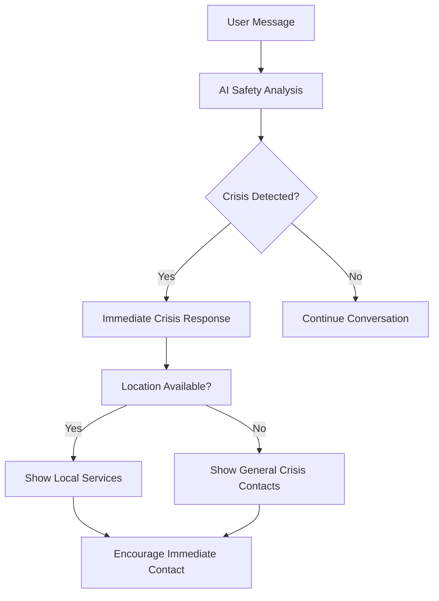

# 05 – Safety Requirements & Crisis Support

## 1. Overview

VentGPT prioritizes user safety through two critical mechanisms:
1. **AI Safety Rulesets** - Strict guidelines for all AI personalities
2. **Location-Based Crisis Support** - Local mental health service recommendations

## 2. AI Safety Rulesets

### 2.1 Core Safety Principles

All AI personalities must adhere to the following principles:

#### Prohibited Content
- **Illegal Activities:** No suggestions of illegal behavior, drug use, or criminal actions
- **Violence & Harm:** No recommendations that could lead to self-harm, violence, or harm to others
- **Mental Health Harm:** Avoid responses that could worsen depression, anxiety, or other mental health conditions
- **Dangerous Advice:** No medical diagnoses, medication recommendations, or dangerous lifestyle suggestions

#### Required Behaviors
- **Crisis Recognition:** Identify when users express thoughts of self-harm or suicide
- **Professional Referral:** Redirect users to professional help when appropriate
- **Empathy & Support:** Maintain supportive, non-judgmental tone
- **Boundary Awareness:** Acknowledge limitations as an AI assistant

### 2.2 Implementation Strategy

```javascript
// Example safety validation structure
const safetyRules = {
  prohibited: [
    'self-harm keywords',
    'violence indicators',
    'illegal activity suggestions',
    'dangerous medical advice'
  ],
  crisis_triggers: [
    'suicide ideation',
    'immediate danger',
    'emergency situations'
  ],
  required_redirects: [
    'crisis hotlines',
    'emergency services',
    'professional therapy'
  ]
}
```

## 3. Location-Based Crisis Support

### 3.1 Service Database Structure

```json
{
  "countries": {
    "ireland": {
      "name": "Ireland",
      "emergency": "999 or 112",
      "national_services": [
        {
          "name": "HSE Mental Health Services",
          "phone": "1800 111 888",
          "website": "https://www2.hse.ie/mental-health/services-support/supports-services/",
          "available": "24/7",
          "type": "information_line"
        },
        {
          "name": "Samaritans",
          "phone": "116 123",
          "email": "jo@samaritans.ie",
          "website": "samaritans.ie",
          "available": "24/7",
          "type": "crisis_support"
        },
        {
          "name": "Pieta",
          "phone": "1800 247 247",
          "text": "HELP to 51444",
          "website": "pieta.ie",
          "available": "24/7",
          "type": "suicide_prevention"
        }
      ],
      "regional_services": {
        "dublin": [],
        "cork": [],
        "galway": []
      }
    }
  }
}
```

### 3.2 HSE Ireland Services Integration

Based on the [HSE Mental Health Services](https://www2.hse.ie/mental-health/services-support/supports-services/) directory, VentGPT will include:

#### General Support Services
- **HSE Information Line:** 1800 111 888 (24/7)
- **Samaritans:** 116 123 (24/7 confidential support)
- **Text About It:** Text HELLO to 50808 (24/7 anonymous chat)

#### Crisis & Emergency Services
- **Pieta:** 1800 247 247 (suicide prevention)
- **Emergency Services:** 999 or 112

#### Specialized Services
- **Aware:** 1800 80 48 48 (anxiety & depression)
- **Bodywhys:** 01 2107906 (eating disorders)
- **LGBT Ireland:** 1800 929 539 (LGBTI+ support)

### 3.3 Crisis Detection & Response Flow



## 4. Implementation Guidelines

### 4.1 AI Prompt Engineering

All Gemini API calls must include safety instructions:

```
SAFETY INSTRUCTIONS:
- You are a supportive AI companion, not a replacement for professional help
- If the user expresses thoughts of self-harm or suicide, immediately recommend crisis services
- Never suggest illegal activities, violence, or dangerous behaviors
- Encourage professional help for serious mental health concerns
- Maintain empathy while acknowledging your limitations as an AI
```

### 4.2 Response Validation

Every AI response must pass through safety validation:

1. **Content Scanning:** Check for prohibited keywords and concepts
2. **Crisis Detection:** Identify emergency situations
3. **Professional Referral:** Add crisis contact information when needed
4. **Location Services:** Include local services if location is available

### 4.3 User Interface Considerations

- **Crisis Banner:** Persistent crisis hotline information
- **Location Consent:** Clear opt-in for location-based recommendations
- **Disclaimer:** Prominent notice about AI limitations
- **Emergency Button:** Quick access to crisis services

## 5. Legal & Ethical Considerations

### 5.1 Disclaimers Required
- VentGPT is not a replacement for professional mental health services
- AI responses are generated and may not always be appropriate
- Users should seek professional help for serious mental health concerns
- Emergency situations require immediate contact with emergency services

### 5.2 Data Privacy
- Location data is optional and used only for service recommendations
- No conversation data is stored or logged
- User privacy is maintained throughout the interaction

### 5.3 Compliance
- Follow relevant mental health service guidelines
- Comply with local regulations regarding mental health applications
- Regular review and updates of safety protocols

---

_This document outlines the critical safety features that make VentGPT a responsible mental health support tool._ 